# Project 4 - Design & Plan

Be clear and concise in your writing. Bullets points are acceptable.


# Planning

## Client Description (Milestone 1)
> Tell us about your client. Who is your client? What kind of website do they want? What are their key goals?

Our client is **Cornell Club Tennis**. Cornell Club Tennis is Cornell University's co-ed sub-varsity tennis team that is entirely student-run. Representing Cornell University, they compete against other college club teams in national, regional, and local tennis tournaments, and through the USTA's "Tennis on Campus" circuit. Their goal as a club is to provide Cornell students who have prior tennis experience the ability to practice their tennis skills and compete at a high-level while emphasizing the 'fun' in playing tennis.  

> NOTE: **If you are redesigning an existing website, give us the current URL and some screenshots of the current site.** Tell us how you plan to update the site in a significant way that meets the Project 4 requirements.

**Current URL for their existing website:**
https://cornellclubtennis.weebly.com

Cornell Club Tennis' current website has a total of 7 webpages - screenshots of which can be found below:

1. **Home Page**


2. **Team Page**


3. **Service Page**


4. **Compete Page**
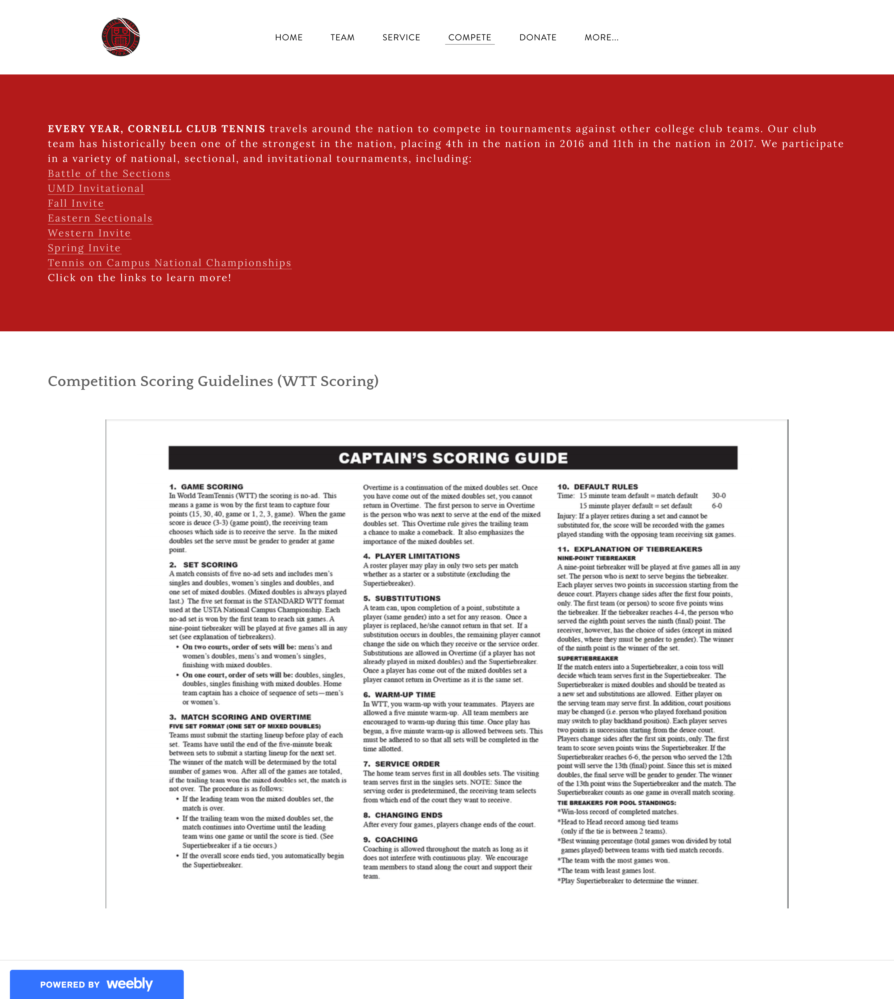

5. **Donate Page**
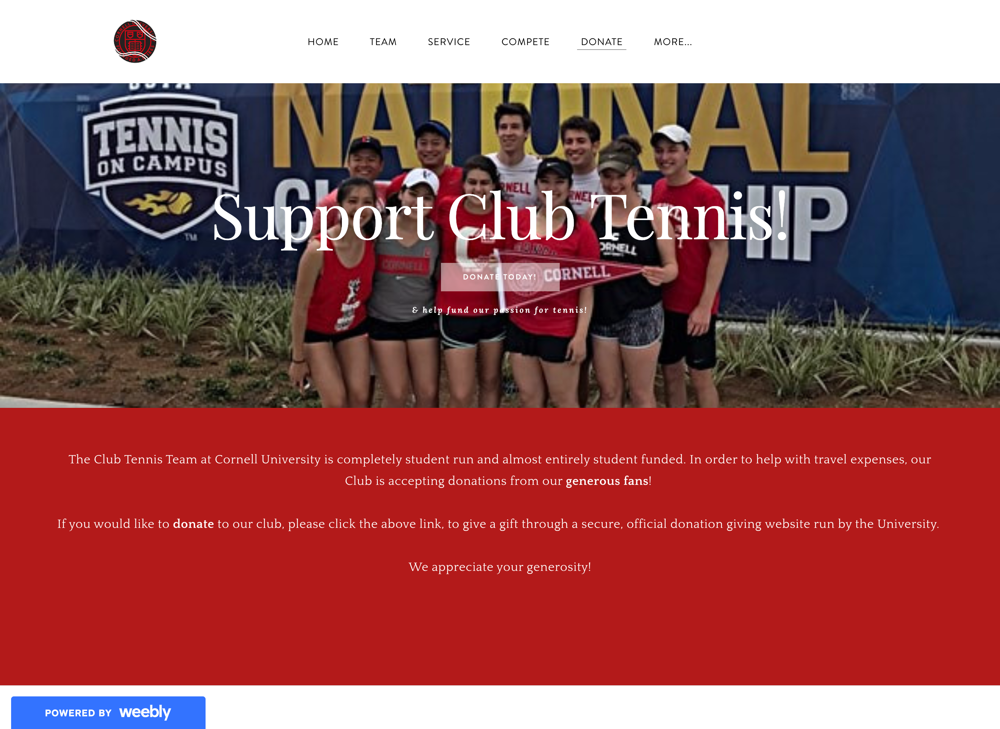

6. **Try Out Page**
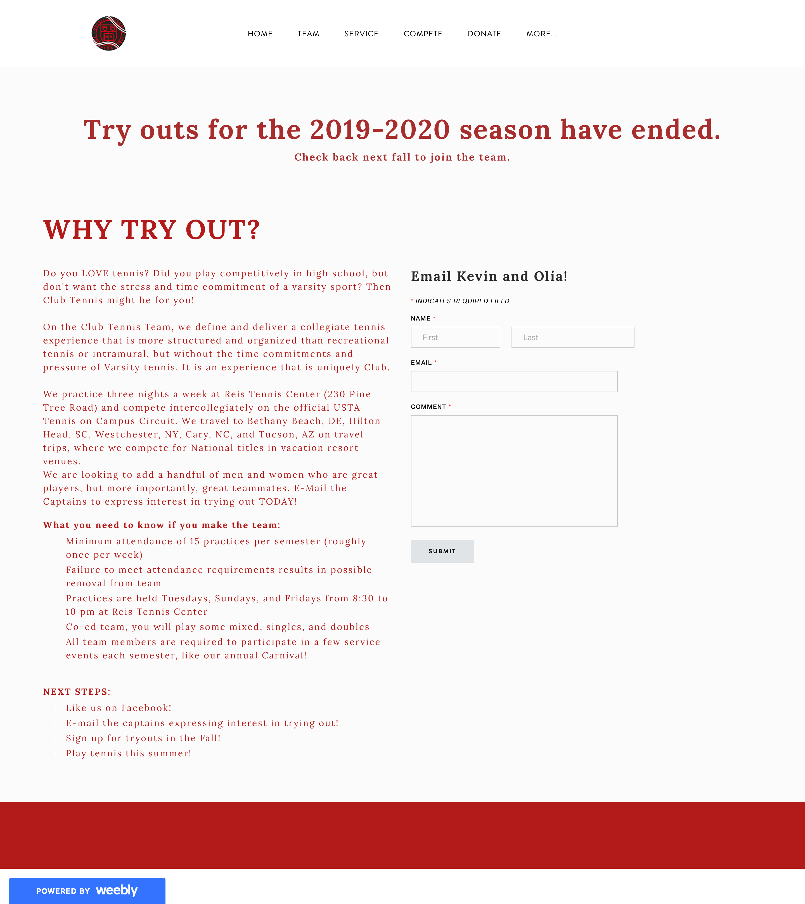

7. **Contact Us Page**
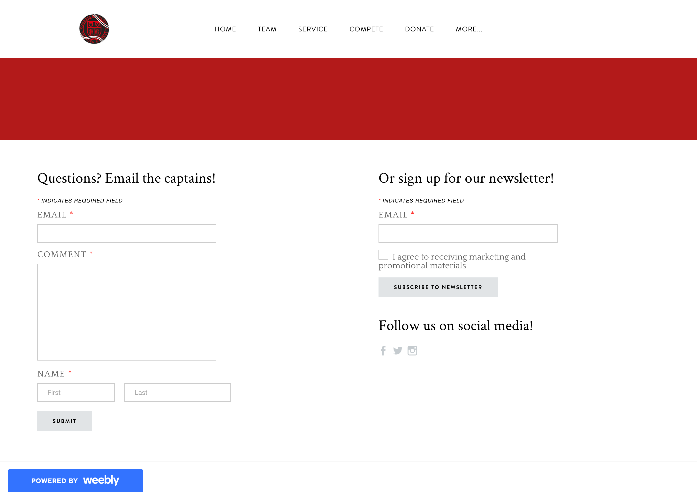


## Site's Purpose (Milestone 1)
> Tell us the purpose of the website and what it is all about.

According to our client, the purpose of the Cornell Club Tennis website is to attract prospective members to join the team, showcase current team members to the greater Cornell community, and inform alumni and parents of the club's accomplishments and competition records. The current website shows who the members of the team/board are, what type of service events they have done, how interested recruits can try out for the team, what accomplishments they have achieved from competitions, how to contact them, and how others can support the club through donations.

## Client Meeting Notes (Milestone 1)
> Include your notes/minutes from the client meeting, an email they sent you, or whatever you used to keep track of what was discussed at the meeting.

<!-- Every group member contributed to this section using Teletype -->

- Date of meeting : Nov. 19,2019 @ 4:30 pm with Kevin who is the Captain of Cornell Club Tennis

During our first meeting with the client, we asked them the following questions to get a better understanding of their needs and wants. The following pictures show the sections of the existing website that were looked over with the client and potential changes to them.
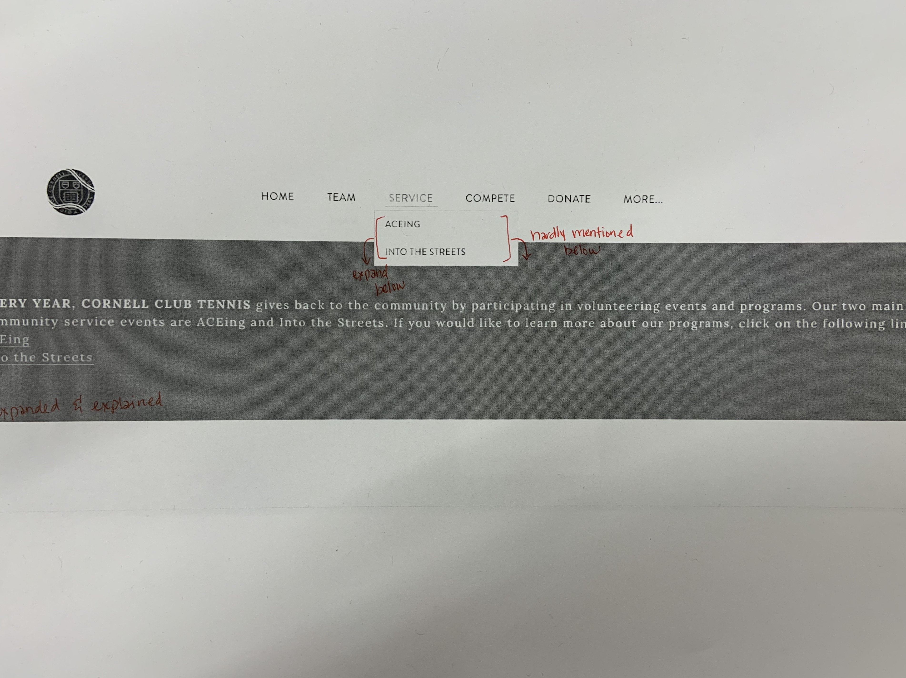
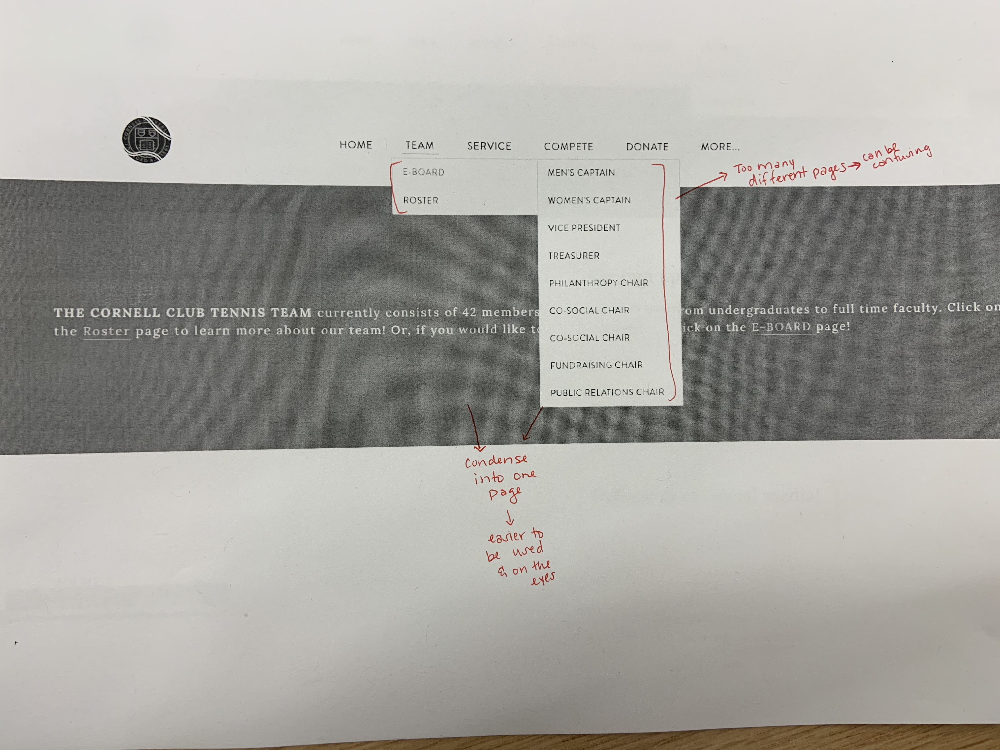
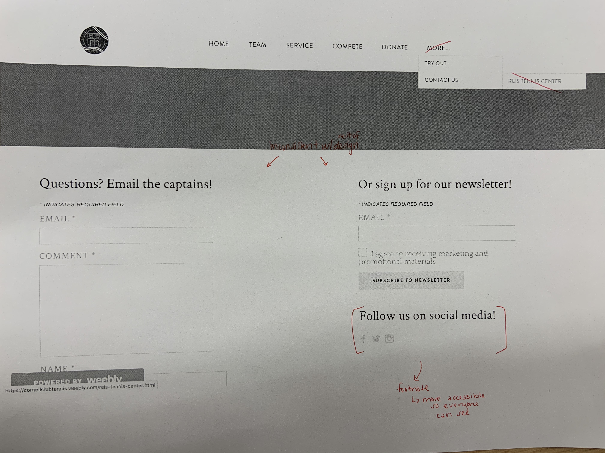

1. **What is the purpose of your website? Is it primarily informative? Are you recruiting? i.e., what kinds of goals do you as the client have?**

- The main purpose of the website is to recruit Cornell students to join the club tennis team. The website's intended use is to grab the attention of prospective members of the Cornell community. Along with this main purpose the captain wanted the website to showcase how competitive the team is (showing scores) and to allow parents (part of the intended audience) to check on the team.

2. **What is the key message you would like your site to communicate?**
- The key message is to show how competitive the team is and how prospective members can join the team by trying out.

3. **Who is the intended audience of this site?**
- The following are a list of intended audience we came up with based on the original website and from our client's input:
  - Prospective team members-students who are interested in competing on the team and want to see how competitive the team is and how they can join.
  - greater Cornell community
  - parents who might be interested in knowing how the team is performing
  - **Prospectives (high schoolers or students at Cornell)** are the most important intended audience
      - open to anyone from any year
  - As a team, we warned the captain that it is better to have one audience, and more beneficial to get a message across.

4. **What types of people will be visiting your site? What are they looking for? What do you expect them to want to do on the site?**
- The intended audience (prospective team members) as well as parents will be visiting the site most often.
  - Prospectives will use the site to see when they can tryout and determine if they want to join based on the information on the site.
  - Parents will use it to stay up to date and follow the students through their competitions through pictures.

5. **What interactive elements would you like implemented?**
- The email feature is important because the team receives a lot of emails during try-out season.

6. **Additional Key Information**
- The captain does not know how much the donation feature is used.
- Current forms are used for :
  - user uses the form to talk about their own experiences
  - Email form is main use of contact
- Team Page
  - owner likes the meet the e-board aspect, but said it is not necessary
  - get rid of layers (ie subpages)
- Tryouts
  - open tryouts
  - tryout = misaligned (style)
- Comments to captain about what we can and cannot do :
  - not allowed to hotlink (current twitter homepage embedded) put a placeholder (allowed to do that for them)
  - may not be able to use actual Cornell logo but team has its own logo

## Client Needs and Wants (Milestone 1)
> Collect your client's needs and wants for the website. Come up with several appropriate design ideas on how those needs may be met. In the **Memo** field, justify your ideas and add any additional comments you have. There is no specific number of needs required for this, but you need enough to do the job.

1. **Needs/Wants: Recruit**
- **Needs and Wants** [What does your client need and want?]
  - One major client want is to recruit Cornell students to get new Cornell Tennis Club members.
- **Design Ideas and Choices** [How will you meet those needs and wants?]
  - We will dedicate a page titled "Tryouts" to make recruitment a main part of the website.
  - "Tryouts" will include relevant recruitment and tryout information.
- **Memo** [Justify your decisions; additional notes.]
  - By making "Tryouts" its own page, we are making sure that it is a focus of the website and that major part of the website is dedicated to facilitating the process of recruiting new members and providing relevant tryout information as the client wants.

2. **Needs/Wants: Showcase current members**
- **Needs and Wants** [What does your client need and want?]
  - The client wants to showcase their current members, especially their E-board. During the meeting, they were very specific about wanting to give their E-board members specific recognition and extra space on their website.
- **Design Ideas and Choices** [How will you meet those needs and wants?]
  - We have a page titled "Team" dedicated to giving all team member information.
  - We will include a section on the "Team" page specifically detailing E-board members, complete with short biographies and pictures of each, as well as each person's role on the board.
  - We will also have a section of the "Team" page to recognize the rest of the club members, such as with group photos.
- **Memo** [Justify your decisions; additional notes.]
  - Having a separate "Team" page will showcase club members, and a separate section in that page for E-board members will give them the recognition and attention that is so important to the client. With this "Team" page design, team information will all be organized in one place, with the E-board members featured as per the client's needs, as well as recognition of the other team members.

3. **Needs/Wants: Connection with users**
- **Needs and Wants** [What does your client need and want?]
  - The client wants prospective members to be able to connect with the team easily. In our first client meeting, the client stated that their form to contact the team is widely used especially during tryout season.
- **Design Ideas and Choices** [How will you meet those needs and wants?]
  - We will have the social media at the footer of all pages. This will be there because no matter what page the user clicked on, they will have the ability to connect with the team on any social media platforms.
  - A newsletter form will be inputed so users can opt to receive it.
- **Memo** [Justify your decisions; additional notes.]
  - By having different options for users to connect they will be more inclined to do so. It is a sense of branding that will allow for more users to connect. That is why the consistency of having the social media links on the footer will be repetitive and users will click on it more.

4. **Needs/Wants: Showcase competitiveness of team**
- **Needs and Wants** [What does your client need and want?]
  - The client wants to have all the competitions that they compete in on the website, as well as scores. This was something that was repeated in our meeting with him.
- **Design Ideas and Choices** [How will you meet those needs and wants?]
  - A page titled **competition** will be created and used. On this webpage, there will be a list of all the competitions and pictures of the team competing.
- **Memo** [Justify your decisions; additional notes.]
  - By having a page dedicated to the team's competitiveness, it will be highlighted. Not only does this meet this need, but also it hits on the side audience of having parents follow the team.
  - A slideshow of pictures is important on this page because only allowing the user to see scores is less effective. Pictures captures the attention of users more so, and by having a slideshow, it would create a stronger sense of the team competing.


## User(s) (Milestone 1)
> Tell us about the users (target audience) for this website.

The target audience for this website is prospective members of Cornell Club Tennis who are interested in joining the club. Prospective members represent any Cornell student (both undergraduate and graduate) who is interested in or has had experience in playing tennis competitively and would like to continue competing throughout their college experience. While our client mentioned multiple audiences including parents and alumni, our client agreed that the primary target audience for their website are potential team recruits.

## Discovering Users' Needs (Milestone 1)
> You'll need to discover your users' needs. Talk to them! Document what you've learned about them. When talking to your users, take notes and include those notes here.

Notes on Users' Needs (both users are former prospective members of Cornell Club Tennis who used the website prior to joining the club):
1. **User 1: Andrew Lee** (this user used the website before coming to Cornell, because he was interested in trying out)
    - **Purpose of his use:**
        - to check out the members on the team
        - to see how well the team did at tournaments
        - to see how serious the team was
        - to see who the captains were
        - to see requirements expected of team members (i.e. there's a minimum quota of practices to make, required to do community service)
    - **Things he wanted to see more on the website:**
        - a little bio on all the players on the team (not just the e-board)
        - More appealing information about the club for people who don't know anything about club tennis (i.e. outreach activities, activities besides tennis)
    - **Information he found useful on existing website:**
        - the tryout page on the website is helpful
            - "it gave me a better idea of what I was getting myself into when I was trying out"
        - contact information was needed to message captains via Facebook
2. **User 2: Caroline Zhou** (this user used the website after enrolling in Cornell but prior to joining Cornell Club Tennis; found website URL from club's Facebook page)
    - **Purpose of her use:**
      - to confirm her interest in the club (she knew that she wanted to play tennis competitively in college)
      - to seek more information about when and where tryouts are held
      - to check member requirements and club's participation in competitions
    - **Things she wanted to see more on the website:**
      - more emphasis on tryouts for prospective members (tryout section isn't in main headline/ not obvious on navigation bar)
      - larger font size for greater visibility
      - more concise information
      - more pictures of club members that demonstrate team bonding and club friendliness
    - **Information she found useful on existing website:**
      - history of competition scores and ranks (confirmed her interest in the club)
      - tryout information details (i.e. date + location)
      - contact information of team captains (contacted captains to learn more about the club)
      - information and pictures of members (helped her visualize the diversity of team members before joining)

## Users' Needs (Milestone 1)
> Analyze the users' needs and wants from your notes above. List each need/want below. There is no specific number of needs required for this, but you need enough to do the job.
> **Note:** These are probably *not* the needs of your client.

1. **Need/Want: More focus on members**
- **Needs and Wants** [What do the users need and want?]
  - A small biography of all the players on the team (not just the e-board)
    - User's reasoning: wanted to know more about the teammates to see who he would be once he joined
  - More pictures of the team to appeal to general public
- **Design Ideas and Choices** [How will you meet those needs and wants?]
  - We will try to allocate spaces for some biographical information on general members, including e-board (i.e. name, major, year, hobbies, other involvements)
  - This will be on the "Team" webpage.
  - We will try to put more photos of the team in the home page to make the website more appealing to the general public
- **Rationale & Additional Notes** [Justify your decisions; additional notes.]
  - Our user interviews indicate that they were interested in trying out partly because of the diversity of members they see on the website. Browsing member profiles gave them a clearer idea of who the team was and what they were like.  Thus, we think it is important to emphasize 'member' information in more detail because this information played a substantial role in helping our users decide to tryout.

2. **Need/Want: Emphasize the 'tryouts' page**
- **Needs and Wants** [What do the users need and want?]
  - clear and concise information about when and where tryouts are held
  - detailed requirements expected of members
      - participation in community service
      - attendance requirements for practice and competitions
- **Design Ideas and Choices** [How will you meet those needs and wants?]
  - We will have a separate webpage dedicated to tryouts - this would include all the member requirements, when and where tryouts are taking place, and any other important information regarding recruitment for prospective tennis club members.
  - We will also emphasize the 'tryouts' page more on the navigation bar by placing it next to or near the home page button
- **Rationale & Additional Notes** [Justify your decisions; additional notes.]
  - Our users mentioned that information about 'tryouts' is particularly important because it helps them identify when and where tryouts are being held as well as understand what obligations members are expected to fulfill. Because the 'tryouts' page is currently hidden under 'more' on the existing website's navigation bar, we decided to

3. **Need/Want: More pictures that demonstrate team bonding and friendliness**
- **Needs and Wants** [What do the users need and want?]
  - more team-bonding group pictures that visualize the team's overall friendliness
  - more pictures of the team practicing tennis together
- **Design Ideas and Choices** [How will you meet those needs and wants?]
  - We will add more group team pictures in webpages that are most likely to experience user traffic, which are "Home" and "Tryouts". This is because prospective members who are interested in joining the club are most likely going to click on these webpages in order to discover whether the club is the right fit for them.
  - We will also add more team bonding pictures in the "Service" webpage to convey more of Cornell Club Tennis' friendliness to prospective members.   
- **Rationale & Additional Notes** [Justify your decisions; additional notes.]
  - Our user interviews demonstrated that there was a lack of friendliness conveyed in the club's existing website. The users we interviewed would like to see more of what the club's personality is like on the website so they have a clearer idea of whether they  fit with the club culture. Hence, adding more pictures that demonstrate team bonding can give users a better sense of what the club is like and what they stand for.

4. **Need/Want: More concise information**
- **Needs and Wants** [What do the users need and want?]
  - less redundancy and repetition in terms of contact information
  - more straightforward descriptions for tryouts
- **Design Ideas and Choices** [How will you meet those needs and wants?]
  - We will remove the redundant elements we found on the club's existing website, such as the two contact forms we found under the 'Tryouts' and 'Contact' webpages
  - We will remove unnecessary information in the 'Tryouts' page and reword the information so that it is more concise, straightforward, and easy to understand.
- **Rationale & Additional Notes** [Justify your decisions; additional notes.]
  - We decided to remove redundant elements such as the two contact forms and make information for 'tryouts' more concise because according to our user interviews, this can help eliminate confusion among prospective team members who are interested in joining the club, make relevant information (i.e. such as tryout details) easier to find and understand, and maintain interest among potential members who browse through the website.


## User Testing Plan (Milestone 1)
> Plan out your tasks for evaluating whether your site will meet the needs of the users. These must be actual user testing tasks. Tasks are not questions!

1. Sign up for the team newsletter using your Cornell email address (you will be unsubscribed after).

2. Imagine that you are a prospective club member who wants to join the team. Find a way to contact the team about try out times.

3. Find the 2018 National Championships results of the team.

4. Determine who the team captains are.

## Content (Milestone 1)
> Plan out your site's content (text, images, etc.). Make a list of **all** the content you will need. This list should be **exhaustive**.

<!-- Every group member contributed to this section using Teletype -->

1. **Pictures**
- Logo image
- Individual E-board pictures
- Individual team member pictures
- Group team pictures (for home, roster)
- Pictures of team playing (x4) for image gallery
- Pictures of service activities
2. **Text**
- General club information
- Descriptions of E-board members' role
- Descriptions of each team members' role in the club
- Mission and goal of the club
- Description of team outreach activities (i.e. service)
- Recruitment information (i.e. time and location for tryouts depending on semester)
- Club member requirements
- Club social media links
- Club captains' email contact information
- Competition information (i.e. scores and ranks)
- Competition description
- Donations link
3. **Form**
- Javascript form for subscribing to team's newsletter


## Interactivity Ideas (Milestone 1)
- **Image gallery on homepage**: a centered image gallery of team pictures. Meant to showcase team playing and practicing. Will have images and captions provided by the client.
- **Javascript newsletter form**: Form that people can fill out to get on the mailing list. This will be both for prospective members and alumni/parents who want to know what the team is up to. We will remove the redundant recruiting tryout and contact us forms which essentially are stand ins for just listing some emails to contact.
- **Dropdown menu for competitions page**: dropdown menu that allows website user to view more information about competition scores for every competition when a competition button in dropdoown is selected  

# Design & Evaluation

## Design Process (Milestone 1)
> Document your design process. Show us your card sorting. Design your navigation from the card sorting. Outline your navigation. Describe your theme. Show us sketches of your site (mobile and desktop versions). etc.
> You should show us how your came up with your design and how your iterated on that design; show us the evolution of your design.

> **Note:** Card sorting is used to organize your site's content. For each piece of content identified in the previous section, write a summary of that content onto a card. Now sort the cards. The grouping of cards provides you with your pages for your website. **Do not write down the pages you want and then "card sort" those. That is not card sorting.**

**Organization of content and website navigation**

1. **First card sorting:**

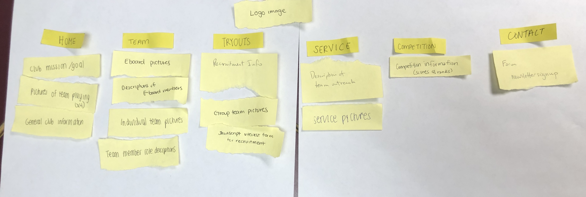

This is our first card sorting. We decided to put the logo image in every page for design consistency which is why we put it at the top of the card sorting page. We initially decided to distribute the website's relevant information into 6 pages: Home, Team, Tryouts, Service, Competition, and Contact. We put all the contents for the general club information under 'Home', the information about the specific members of the team in the 'Team' page, and put recruitment information in the 'Tryouts' page. We also decided to put the team picture in the 'Tryouts' page, because we felt that this would appeal to prospective students. We made a separate 'Contact' page for those interested to contact the team or to fill out a newsletter/interest form. We placed the 'Team' and the 'Tryouts' pages near the front of the navigation bar because during the user interviews, we found that users were mainly looking for information about the team and tryout time and location details.

2. **Second card sorting:**

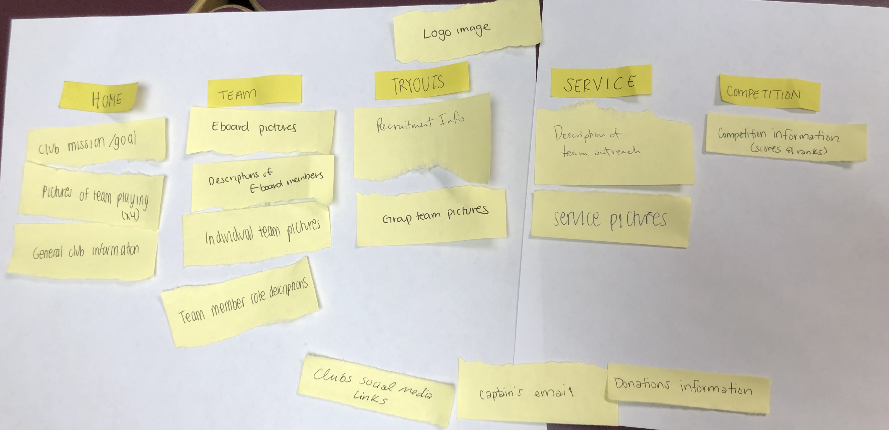

For our second card sorting, we decided to remove the contacts page and add a footer to each page that contains social media links, the captain's email, and donation information. This makes it easy for users to contact the club from any page, improving the usability of the site for the target audience, who may want to join the club and will want to contact the club to tryout. We then thought that this feature made the "Contact" page unneeded, as this sufficiently met the user's need to contact the club. This also made the "Tryout" page's interest form unnecessary as its only real purpose was to send an email to the club, which is easily done with this card sorting through the email address given at the bottom of each page. The "Donate" feature also belongs in the footer as we felt it would be wasteful to create a whole page just for donations when it could be easily added as a feature at the bottom of each page, especially since a "Donate" feature is extra, and not absolutely necessary to fulfill the major purposes of the site. It is a good thing to have on the site but it does not need to be featured in the nav bar as its own page.

3. **Final card sorting:**

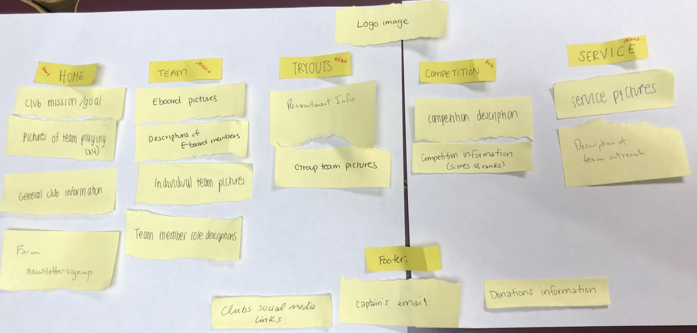

For our third and final card sorting, we decided to add a 'newsletter signup' form at the bottom of the home page instead of remove it completely, because our client specifically mentioned that his newsletter is open to anyone interested in receiving news and updates about Cornell Club Tennis (i.e. such as parents and alumni). Because we removed the 'Contact' page from the second card-sorting, which used to contain the 'newsletter' form, we wanted to ensure that the form is visible to website visitors by placing it on the homepage. In this way, website users can easily sign up for the newsletter. Furthermore, we switched the 'Competition' and 'Service' webpages on the navigation bar because the client wanted to place more emphasis on the club's competition record and highlight this information to website visitors. Nevertheless, in order to convey the 'friendliness' that our users wanted from our user interviews, we decided to put service pictures before the service description in the 'Service' webpage so that website visitors are more easily aware of the club's personality.

**Website Theme**

The theme for this website is minimalistic but bold. We want our website redesign to convey a friendly and welcoming atmosphere to potential visitors so that prospective members (i.e. which represents the website's target audience) are inclined to join the tennis club. Cornell Club Tennis is a competitive tennis club that represents Cornell University in the competitions they participate in, so we decided to maintain the existing website's use of bold Cornell colors (i.e. Carnelian red) and incorporate secondary colors such as gray and white to complement school colors.

The following desktop and mobile sketches represent the organization and layout of our webpages based on what we decided suits our client's and user's needs the most during our card-sorting process.

**Desktop Sketches**

1. **'Home' page**
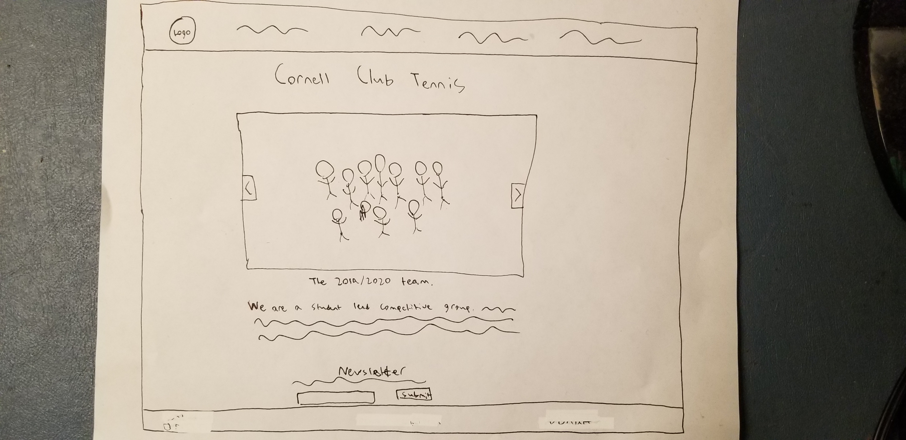

2. **'Team' page**
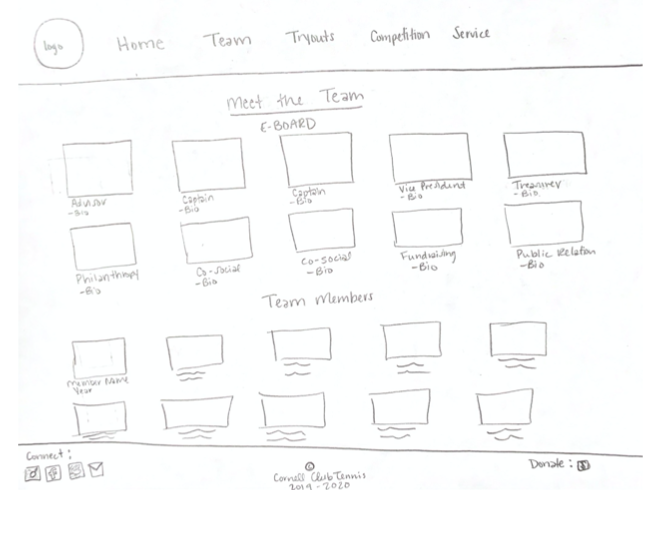

3. **'Tryouts' page**
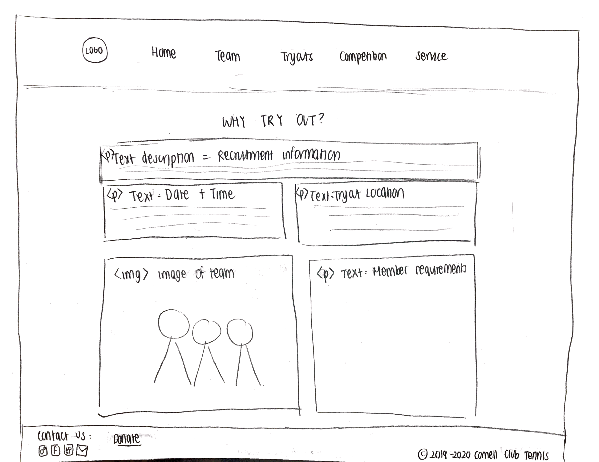

4. **'Competitions' page**
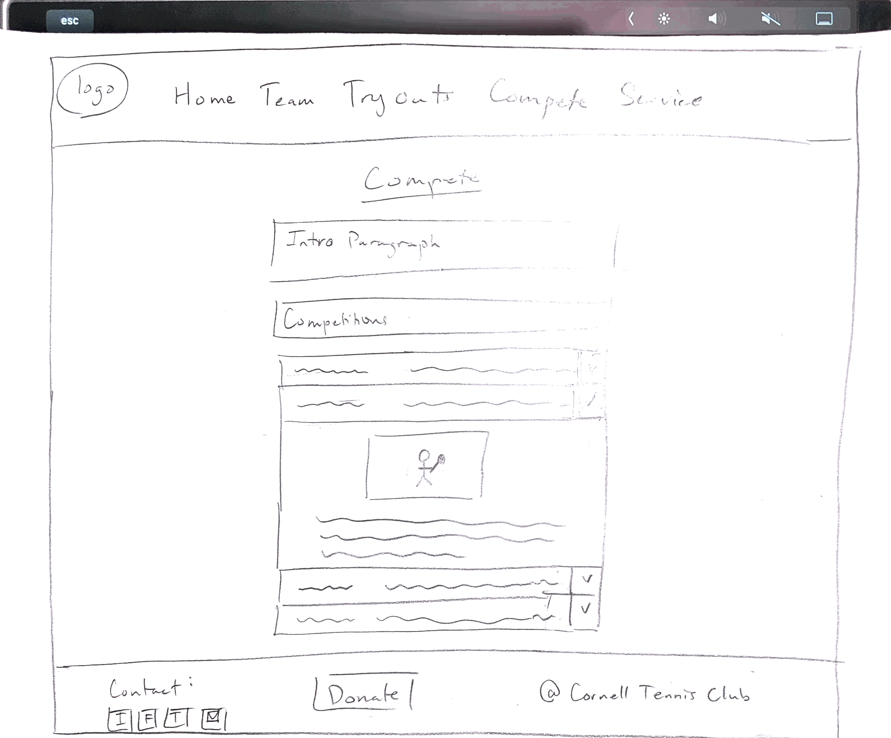

5. **'Service' page**
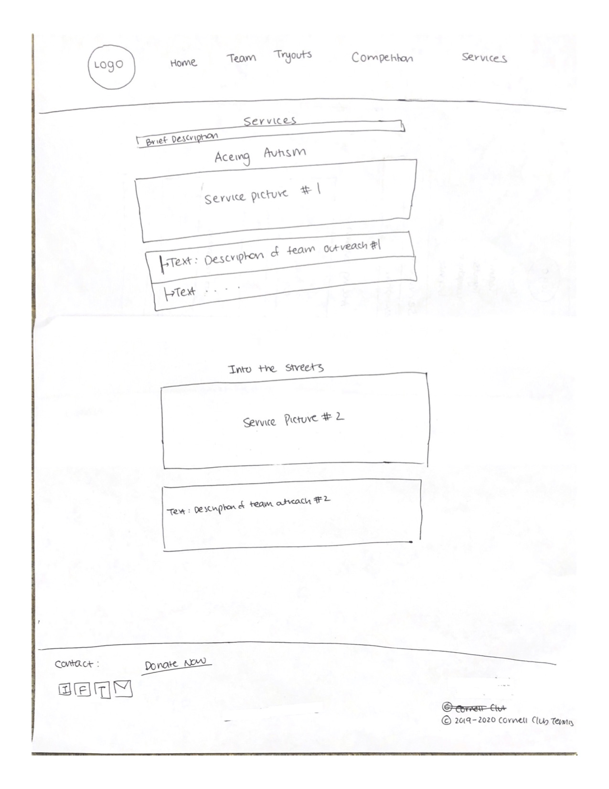

**Mobile sketches**

1. **'Home' page**
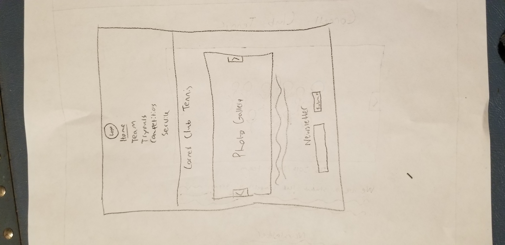

2. **'Team' page**
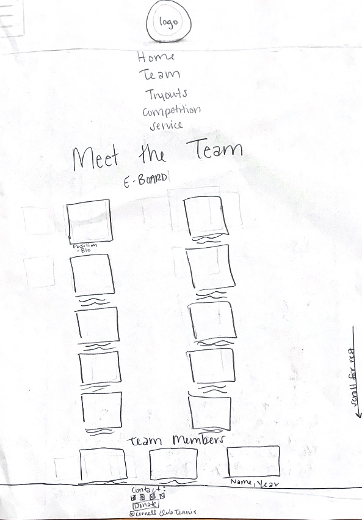

3. **'Tryouts' page**
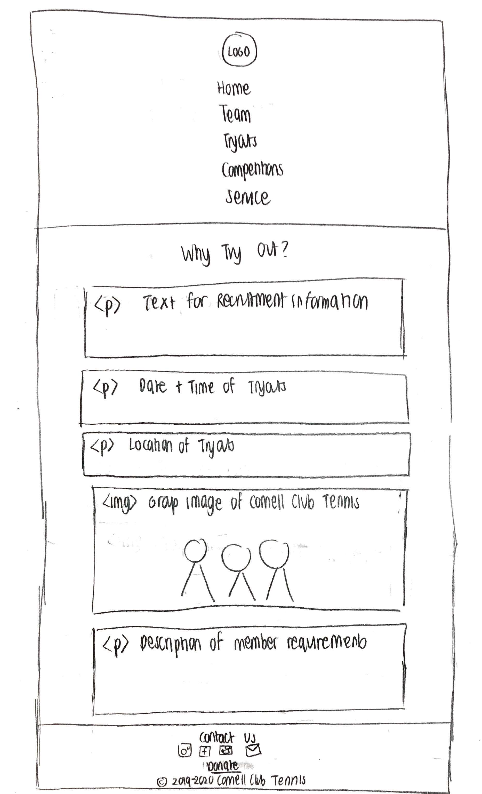

4. **'Competitions' page**
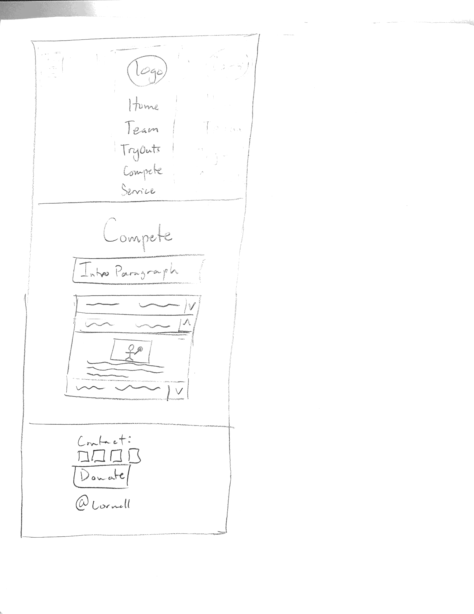

5. **'Service' page**
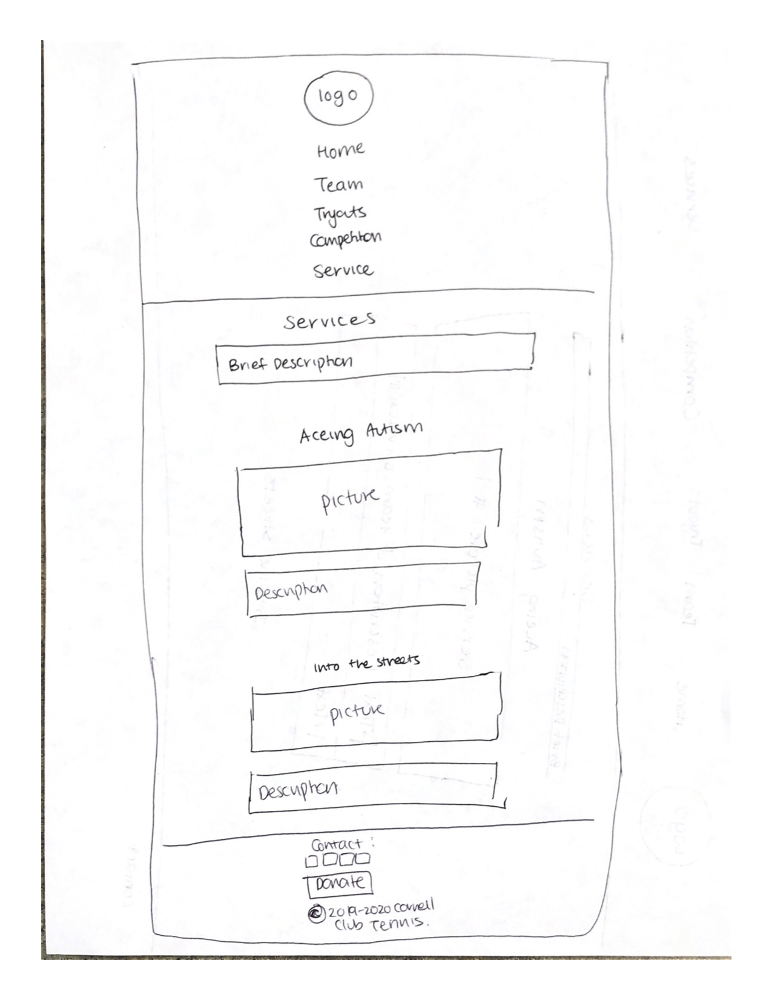

## Interactivity (Milestone 1)
> What interactive features will your site have? Describe how the interactivity connects with the needs of the clients/target audience.

We will have three main pieces of interactivity:
1. **An image gallery on the home page.** This is a compact way of showing off the team group picture, practices, and competitions to visitors. This will help make a good impression on the target audience (prospective team members) by giving a broad overview of the team activities in a visually compelling format. It will use two buttons (a left and right button) to scroll through the images as needed.
2. **A newsletter form.** This form makes it easy for prospective members to sign up for regular info about the team, as well as for alumni and parents to get regular updates about the team (to encourage donations). This form will be the only form on the webpage, as the other two forms on the existing web page (one for general contact and one for try out info) are simply a replacement for emailing. We will list contact emails to compensate for removal of these forms.
3. **Dropdown menu for competitions page**: In order to make the 'competition' page less cluttered, we decided to incorporate a dropdown menu that allows the website user to view more information about competition scores if they select it (instead of having all information displayed which can make the website visitor overwhelmed with too much information).


## User Testing (_optional_)
> This testing is optional.

### User 1 - Testing Notes (Milestone 1)
> When conducting user testing, you should take notes during the test. Place your notes here.


### User 1 (Milestone 1)
> Using your notes from above, describe your user by answering the questions below.

1. Who is your user, e.g., where does the user come from, what is the user's job, characteristics, etc.?


2. Does the user belong to your target audience of the site? (Yes / No)
> If “No”, what’s your strategy of associating the user test results to your target audience’s needs and wants? How can your re-design choices based on the user tests make a better fit for the target audience?


### User 1 - **Desktop** (Milestone 1)
> Report the results of your user's evaluation. You should explain **what the user did**, describe the user's **reaction/feedback** to the design, **reflect on the user's performance**, determine what **re-design choices** you will make. You can also add any additional comments. See the example design journey for an example of what this would look like.

Task: [TODO: copy task here]
- **Did you evaluate the desktop or mobile design?**
  - Pick one: desktop/mobile
- **How did the user do? Did they meet your expectation?**
  - TODO
- **User’s reaction / feedback to the design** (e.g., specific problems or issues found in the tasks)
  - TODO
- **Your reflections about the user’s performance to the task**
  - TODO
- **Re-design choices**
  - TODO
- **Additional Notes**
  - TODO: Justify your decisions; additional notes.

...


### User 2 - Testing Notes (Milestone 1)
> When conducting user testing, you should take notes during the test. Place your notes here.


### User 2 (Milestone 1)
> Using your notes from above, describe your user by answering the questions below.

1. Who is your user, e.g., where does the user come from, what is the user's job, characteristics, etc.?


2. Does the user belong to your target audience of the site? (Yes / No)
> If “No”, what’s your strategy of associating the user test results to your target audience’s needs and wants? How can your re-design choices based on the user tests make a better fit for the target audience?


### User 2 - **Mobile** (Milestone 1)
> Report the results of your user's evaluation. You should explain **what the user did**, describe the user's **reaction/feedback** to the design, **reflect on the user's performance**, determine what **re-design choices** you will make. You can also add any additional comments. See the example design journey for an example of what this would look like.

Task: [TODO: copy task here]
- **Did you evaluate the desktop or mobile design?**
  - Pick one: desktop/mobile
- **How did the user do? Did they meet your expectation?**
  - TODO
- **User’s reaction / feedback to the design** (e.g., specific problems or issues found in the tasks)
  - TODO
- **Your reflections about the user’s performance to the task**
  - TODO
- **Re-design choices**
  - TODO
- **Additional Notes**
  - TODO: Justify your decisions; additional notes.

...


## Final Design (Milestone 1)
> Include the final sketches for each of your pages. These sketches **must** hand-drawn.

**Desktop Design**

1. **'Home' page**


2. **'Team' page**


3. **'Tryouts' page**


4. **'Competitions' page**


5. **'Service' page**


**Mobile Design**

1. **'Home' page**


2. **'Team' page**


3. **'Tryouts' page**


4. **'Competitions' page**


5. **'Service' page**


## Additional Comments (Milestone 1)
> If you feel like you haven't fully explained your design choices, or if you want to explain some other functions in your site (such as special design decisions that might not meet the Project 4 requirements), you can use this space to justify your design choices or ask other questions about the project and process.


---

# Iteration 2

## Client Feedback (Milestone 2)
> You have met once with your client a second time to discuss your initial design. Include your notes from the meeting, an email they sent you, or whatever you used to keep track of what was discussed at the meeting. Write a few sentences about the design feedback you received from your client.

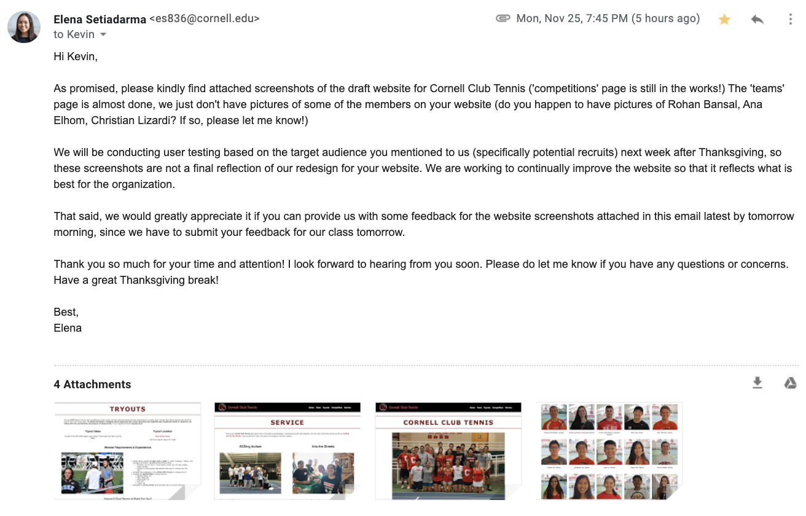
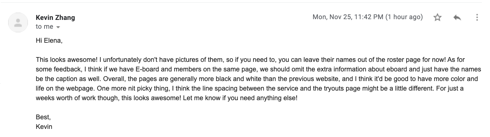

Our client was relatively pleased with our draft website design. We sent him screenshots of our coded draft website via email (which reflects our initial design layout) and based on what we sent (seen in the screenshots above), he suggested us to revise our website design in the following ways:

- increase the line spacing for body text in certain webpages to make the overall website design look more consistent and neat
- incorporate more color onto the website (i.e. adding color to bolded parts of body text)
- omit extra information from the E-board to make E-board member profiles consistent with the other members' information

We thus revised our website design according to our client's feedback.

## Interactivity Plan (Milestone 2)
For image gallery:
```
when DOM is loaded:
  set images variable to array of images [team1.jpg,team2.jpg,team3.jpg, team4.jpg, team5.jpg]
  set current index variable = 0
  when next button is clicked:
    if index is 4:
      set index to 0
    else:
      add 1 to index
    set image source to index of images array
  when back button is clicked:
    if index is 0:
      set index to 4
    else:
      subtract 1 from index
    set image source to index of images array
```

For newsletter form:
```
when DOM is loaded:
  when form is submitted:
    declare formValid true
    if email meets HTML5 validation criteria:
      hide feedack
    else
      show feedback
      set formValid to false
    send form to server if formValid is true
```

For competition dropdowns:
```
when DOM is loaded:
    when "Battle of the Sections" button is clicked:
        show "Battle of the Sections" content
        hide all other invite content
    when "UMD Invite" button is clicked:
        show "UMD Invite" content
        hide all other invite content
    when "Fall Invite" button is clicked:
        show "Fall Invite" content
        hide all other invite content
    when "East Invite" button is clicked:
        show "East" content
        hide all other invite content
    when "Rutgers Invite" button is clicked:
        show "Rutgers Invite" content
        hide all other invite content
    when "West Invite" button is clicked:
        show "West Invite" content
        hide all other invite content
    when "Spring Invite" button is clicked:
        show "Spring Invite" content
        hide all other invite content
    when "TOC National Championships" button is clicked:
        show "TOC National Championships" content
        hide all other invite content
```

## Additional Comments (Milestone 2)
> If you feel like you haven't fully explained your design choices, or if you want to explain some other functions in your site (such as special design decisions that might not meet the Project 4 requirements), you can use this space to justify your design choices or ask other questions about the project and process.

Since our initial website design sketches, we made several changes to our website design to accommodate our client's feedback and to make the overall website design look more aesthetically pleasing:
1. Instead of making the service activities displayed one after another (flex-direction: column), we made the service activities adjacent to one another in the desktop version of the website (flex-direction: row) to make more efficient and effective use of vertical and horizontal whitespace. This also makes it easy for the user to see the service activities since they don't have to vertically scroll down the webpage to find out more about each individual service activity.  
2. We deleted the 'donate' link from the footer due to its lack of visibility. To make the 'donate' button more visible, we moved the link to the home page (index.html) so that it is more visible to potential website visitors.
3. Based on our client's feedback, we omitted extraneous information about E-board member profiles to make member profiles look more consistent with each other.
4. We increased line spacing between lines to make our paragraph text easier to read for potential users.
5. We changed the color of bolded text in paragraphs to incorporate more color into the website (as suggested by our client).


---

# Iteration 3

## Additional Comments (Milestone 3)
> If you feel like you haven't fully explained your design choices, or if you want to explain some other functions in your site (such as special design decisions that might not meet the Project 4 requirements), you can use this space to justify your design choices or ask other questions about the project and process.


---

# Final Evaluation

## Changes Based on Lab 13 Peer Feedback (Final Submission)
> What changes did you make to your design based on your peers' feedback?


## User Testing
> If you conducted user testing in Milestone 1, you only need to user test 2 more users. Otherwise, you must conduct user testing with 4 users.

### User 3 - Testing Notes (Final Submission)
> When conducting user testing, you should take notes during the test. Place your notes here.


### User 3 (Final Submission)
> Using your notes from above, describe your user by answering the questions below.

1. Who is your user, e.g., where does the user come from, what is the user's job, characteristics, etc.?


2. Does the user belong to your target audience of the site? (Yes / No)
> If “No”, what’s your strategy of associating the user test results to your target audience’s needs and wants? How can your re-design choices based on the user tests make a better fit for the target audience?


### User 3 - **Desktop** (Final Submission)
> Report the results of your user's evaluation. You should explain **what the user did**, describe the user's **reaction/feedback** to the design, **reflect on the user's performance**, determine what **re-design choices** you will make. You can also add any additional comments. See the example design journey for an example of what this would look like.

Task: [TODO: copy task here]
- **Did you evaluate the desktop or mobile design?**
  - Pick one: desktop/mobile
- **How did the user do? Did they meet your expectation?**
  - TODO
- **User’s reaction / feedback to the design** (e.g., specific problems or issues found in the tasks)
  - TODO
- **Your reflections about the user’s performance to the task**
  - TODO
- **Re-design choices**
  - TODO
- **Additional Notes**
  - TODO: Justify your decisions; additional notes.

...


### User 4 - Testing Notes (Final Submission)
> When conducting user testing, you should take notes during the test. Place your notes here.


### User 4 (Final Submission)
> Using your notes from above, describe your user by answering the questions below.

1. Who is your user, e.g., where does the user come from, what is the user's job, characteristics, etc.?


2. Does the user belong to your target audience of the site? (Yes / No)
> If “No”, what’s your strategy of associating the user test results to your target audience’s needs and wants? How can your re-design choices based on the user tests make a better fit for the target audience?


### User 4 - **Mobile** (Final Submission)
> Report the results of your user's evaluation. You should explain **what the user did**, describe the user's **reaction/feedback** to the design, **reflect on the user's performance**, determine what **re-design choices** you will make. You can also add any additional comments. See the example design journey for an example of what this would look like.

Task: [TODO: copy task here]
- **Did you evaluate the desktop or mobile design?**
  - Pick one: desktop/mobile
- **How did the user do? Did they meet your expectation?**
  - TODO
- **User’s reaction / feedback to the design** (e.g., specific problems or issues found in the tasks)
  - TODO
- **Your reflections about the user’s performance to the task**
  - TODO
- **Re-design choices**
  - TODO
- **Additional Notes**
  - TODO: Justify your decisions; additional notes.

...


### User 5 - Testing Notes (Final Submission)
> When conducting user testing, you should take notes during the test. Place your notes here.


### User 5 (Final Submission)
> Using your notes from above, describe your user by answering the questions below.

1. Who is your user, e.g., where does the user come from, what is the user's job, characteristics, etc.?


2. Does the user belong to your target audience of the site? (Yes / No)
> If “No”, what’s your strategy of associating the user test results to your target audience’s needs and wants? How can your re-design choices based on the user tests make a better fit for the target audience?


### User 5 - **Desktop** (Final Submission)
> Report the results of your user's evaluation. You should explain **what the user did**, describe the user's **reaction/feedback** to the design, **reflect on the user's performance**, determine what **re-design choices** you will make. You can also add any additional comments. See the example design journey for an example of what this would look like.

Task: [TODO: copy task here]
- **Did you evaluate the desktop or mobile design?**
  - Pick one: desktop/mobile
- **How did the user do? Did they meet your expectation?**
  - TODO
- **User’s reaction / feedback to the design** (e.g., specific problems or issues found in the tasks)
  - TODO
- **Your reflections about the user’s performance to the task**
  - TODO
- **Re-design choices**
  - TODO
- **Additional Notes**
  - TODO: Justify your decisions; additional notes.

...


### User 6 - Testing Notes (Final Submission)
> When conducting user testing, you should take notes during the test. Place your notes here.


### User 6 (Final Submission)
> Using your notes from above, describe your user by answering the questions below.

1. Who is your user, e.g., where does the user come from, what is the user's job, characteristics, etc.?


2. Does the user belong to your target audience of the site? (Yes / No)
> If “No”, what’s your strategy of associating the user test results to your target audience’s needs and wants? How can your re-design choices based on the user tests make a better fit for the target audience?


### User 6 - **Mobile** (Final Submission)
> Report the results of your user's evaluation. You should explain **what the user did**, describe the user's **reaction/feedback** to the design, **reflect on the user's performance**, determine what **re-design choices** you will make. You can also add any additional comments. See the example design journey for an example of what this would look like.

Task: [TODO: copy task here]
- **Did you evaluate the desktop or mobile design?**
  - Pick one: desktop/mobile
- **How did the user do? Did they meet your expectation?**
  - TODO
- **User’s reaction / feedback to the design** (e.g., specific problems or issues found in the tasks)
  - TODO
- **Your reflections about the user’s performance to the task**
  - TODO
- **Re-design choices**
  - TODO
- **Additional Notes**
  - TODO: Justify your decisions; additional notes.

...


## Changes Based on User Testing (Final Submission)
> What changes did you make to your design based on user testing?


## Final Notes to the Graders (Final Submission)
> 1. Give us three specific strengths of your site that sets it apart from the previous website of the client (if applicable) and/or from other websites. Think of this as your chance to argue for the things you did really well.


> 2. Tell us about things that don't work, what you wanted to implement, or what you would do if you keep working with the client in the future. Give justifications.


> 3. Tell us what you, as a team, learned while working on this project.


> 4. Tell us anything else you need us to know for when we're looking at the project.
